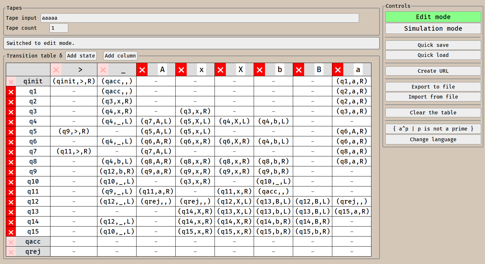

# HTML5 Turing Machine Simulator

## Functions
<ul>
    <li>Simulation of single-tape and multi-tape TM</li>
    <li>Simulation of deterministic and non-deterministic TM</li>
    <li>Save/load: by link, to file, to localStorage</li>
    <li>Interactive graphical editor</li>
    <li>Interactive graphical simulator</li>
    <li>Helpful error messages!</li>
</ul>

## Basic usage

Clone and open the `index.html` in your browser. Should work nicely in Chrome and FF.

<ul>
    <li>Write input to tape(s)</li>
    <li>Fill in the table</li>
    <li>Table input format: <b>(NEXT_STATE, WRITTEN_SYMBOL, TAPE DIRECTION)</b></li>
        <ul>
            <li>Example: <b>(qacc, > , R)</b> will go into state qacc (accepting state), current field will be overwritten with '>', and the head will move to the right</li>
            <li>Non-determinism example: Just write more tuples like <b>(qacc, > , R), (qrej, > , R)</b> the TM will choose one randomly (or you can choose manually during the simulation)</li>
            <li>Multi-tape example: Increase the tape count and the table reformats, the input format is as follows: <b>(NEXT_STATE, S1, S2, S3 , D1, D2, D3)</b>, where S1-S3 are symbols written to tape 1 to 3 and D1-D3 are head movement directions.</li>
        </ul>
    </li>
    <li>Check the included example TMs to see what can be done.</li>
</ul>

